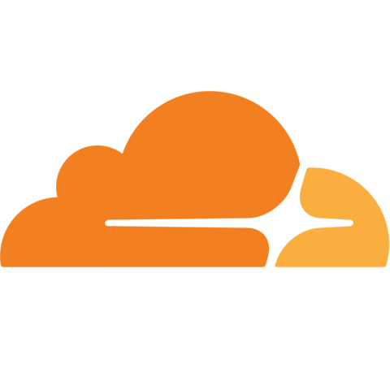

# Remote Access

- Cloudflare Warp is being used for remote access to my homelab
- Subnet's for each site are assigned to a tunnel running on the respective site
- The 10.0.0.0/8 network has been removed from the split tunneling to facilitate routing to remote sites
- DNS forwarding is configured for internal.epichouse.co.uk & lab.epichouse.co.uk

## Public Access
- Cloudflare WAF is placed in front of all public services
- Public services are exposed via cloudflared tunnels
- Where applicable, public services that require additional protection will have Cloudflare Access placed in front of them, requiring authentication